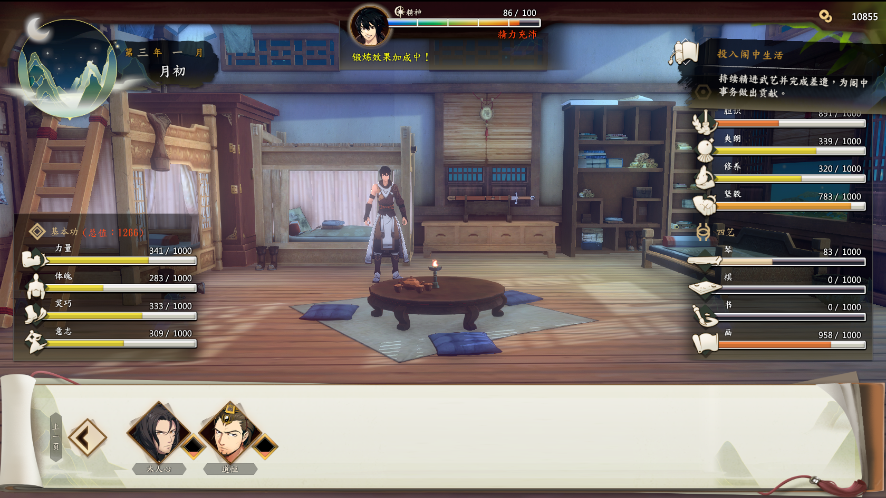
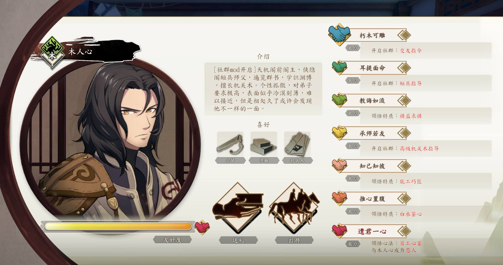
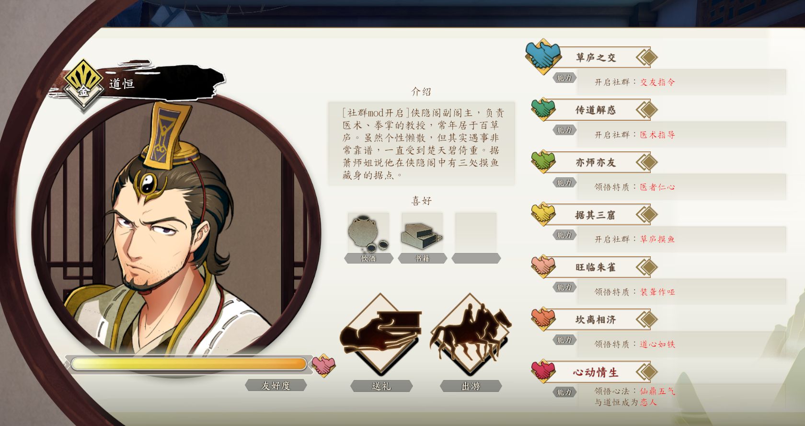

# PathofWuxia Community Mod

## Mod 介绍

简单地说，本 mod 添加了道恒和木人心作为可攻略和交友对象，不过由于这样那样的原因，目前完成的是一个大框架，所有流程都是跑通的，但是还没有填充交友剧情。

最终效果如下图所示：

## Mod 安装说明

### 安装

1. 下载：[powx-community-mod.zip](https://github.com/lanbyss/PoWX-Community-Mod/releases/download/1.0/powx-community-mod.zip)
2. 解压，放到游戏根目录即可。
3. DLL备份替换
4. 存档备份

### 流程说明

1. 先去完成前置传书，开启交友。
1. 完成前置传书后，交友界面解锁。
1. 礼物测试传书里可以领取礼物用于赠送。

## 其他说明

1. 无男女性别限制。
2. 仍然只能选择一位好友成为恋人。

## 致谢

感谢以下开源项目：

1. [Plugin-Pow by Binarizer](https://github.com/Binarizer/Plugin-Pow)
2. [Plugin-PathofWuxia by findsky6544（寻宇）](https://github.com/findsky6544/Plugin-PathOfWuxia)
3. [BepInEx](https://github.com/BepInEx/BepInEx)
4. [Harmony](https://github.com/pardeike/Harmony)
5. [dnSpy](https://github.com/dnSpy/dnSpy)
6. [UnityExplorer](https://github.com/sinai-dev/UnityExplorer)
7. [AssetStudio](https://github.com/Perfare/AssetStudio)
